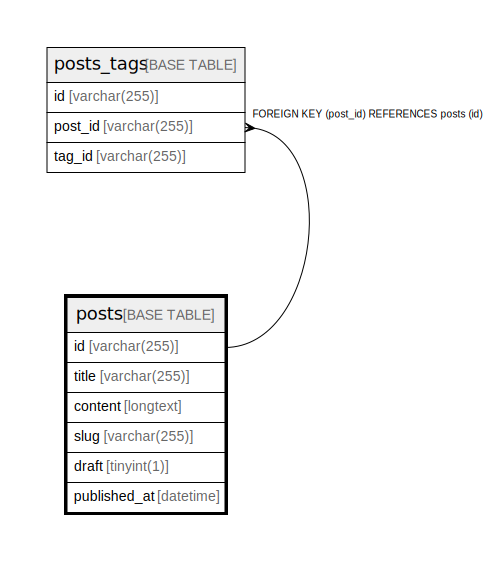

# posts

## Description

<details>
<summary><strong>Table Definition</strong></summary>

```sql
CREATE TABLE `posts` (
  `id` int NOT NULL,
  `title` varchar(255) DEFAULT NULL,
  `content` longtext,
  `slug` varchar(255) DEFAULT NULL,
  `draft` tinyint(1) NOT NULL DEFAULT '1',
  `created_at` datetime DEFAULT CURRENT_TIMESTAMP,
  `updated_at` datetime DEFAULT CURRENT_TIMESTAMP ON UPDATE CURRENT_TIMESTAMP,
  `published_at` datetime DEFAULT NULL,
  PRIMARY KEY (`id`)
) ENGINE=InnoDB DEFAULT CHARSET=utf8
```

</details>

## Columns

| Name | Type | Default | Nullable | Extra Definition | Children | Parents | Comment |
| ---- | ---- | ------- | -------- | --------------- | -------- | ------- | ------- |
| id | int |  | false |  | [posts_tags](posts_tags.md) |  |  |
| title | varchar(255) |  | true |  |  |  |  |
| content | longtext |  | true |  |  |  |  |
| slug | varchar(255) |  | true |  |  |  |  |
| draft | tinyint(1) | 1 | false |  |  |  |  |
| created_at | datetime | CURRENT_TIMESTAMP | true | DEFAULT_GENERATED |  |  |  |
| updated_at | datetime | CURRENT_TIMESTAMP | true | DEFAULT_GENERATED on update CURRENT_TIMESTAMP |  |  |  |
| published_at | datetime |  | true |  |  |  |  |

## Constraints

| Name | Type | Definition |
| ---- | ---- | ---------- |
| PRIMARY | PRIMARY KEY | PRIMARY KEY (id) |

## Indexes

| Name | Definition |
| ---- | ---------- |
| PRIMARY | PRIMARY KEY (id) USING BTREE |

## Relations



---

> Generated by [tbls](https://github.com/k1LoW/tbls)
