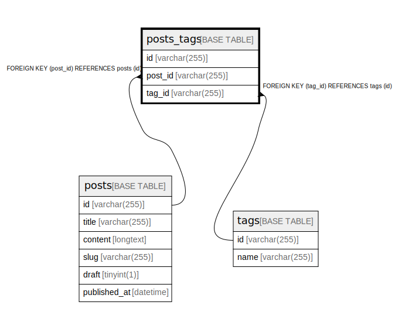

# posts_tags

## Description

<details>
<summary><strong>Table Definition</strong></summary>

```sql
CREATE TABLE `posts_tags` (
  `id` varchar(255) NOT NULL,
  `post_id` varchar(255) NOT NULL,
  `tag_id` varchar(255) NOT NULL,
  `created_at` datetime DEFAULT CURRENT_TIMESTAMP,
  `updated_at` datetime DEFAULT CURRENT_TIMESTAMP ON UPDATE CURRENT_TIMESTAMP,
  PRIMARY KEY (`id`),
  UNIQUE KEY `post_tag_index` (`post_id`,`tag_id`),
  KEY `fk_tag_id` (`tag_id`),
  CONSTRAINT `fk_post_id` FOREIGN KEY (`post_id`) REFERENCES `posts` (`id`) ON DELETE CASCADE ON UPDATE CASCADE,
  CONSTRAINT `fk_tag_id` FOREIGN KEY (`tag_id`) REFERENCES `tags` (`id`) ON DELETE CASCADE ON UPDATE CASCADE
) ENGINE=InnoDB DEFAULT CHARSET=utf8
```

</details>

## Columns

| Name | Type | Default | Nullable | Extra Definition | Children | Parents | Comment |
| ---- | ---- | ------- | -------- | --------------- | -------- | ------- | ------- |
| id | varchar(255) |  | false |  |  |  |  |
| post_id | varchar(255) |  | false |  |  | [posts](posts.md) |  |
| tag_id | varchar(255) |  | false |  |  | [tags](tags.md) |  |
| created_at | datetime | CURRENT_TIMESTAMP | true | DEFAULT_GENERATED |  |  |  |
| updated_at | datetime | CURRENT_TIMESTAMP | true | DEFAULT_GENERATED on update CURRENT_TIMESTAMP |  |  |  |

## Constraints

| Name | Type | Definition |
| ---- | ---- | ---------- |
| fk_post_id | FOREIGN KEY | FOREIGN KEY (post_id) REFERENCES posts (id) |
| fk_tag_id | FOREIGN KEY | FOREIGN KEY (tag_id) REFERENCES tags (id) |
| post_tag_index | UNIQUE | UNIQUE KEY post_tag_index (post_id, tag_id) |
| PRIMARY | PRIMARY KEY | PRIMARY KEY (id) |

## Indexes

| Name | Definition |
| ---- | ---------- |
| fk_tag_id | KEY fk_tag_id (tag_id) USING BTREE |
| PRIMARY | PRIMARY KEY (id) USING BTREE |
| post_tag_index | UNIQUE KEY post_tag_index (post_id, tag_id) USING BTREE |

## Relations



---

> Generated by [tbls](https://github.com/k1LoW/tbls)
